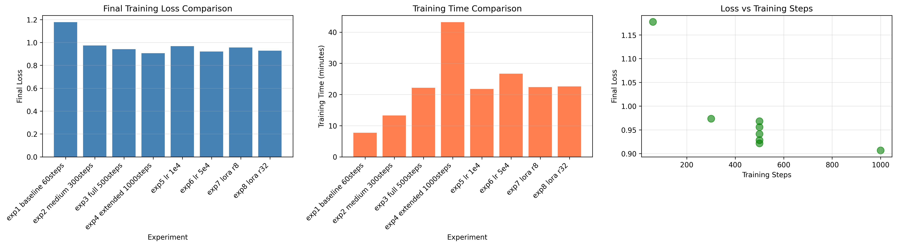

# ID2223 Lab 2: Fine-tuning Llama 3.2 1B with LoRA

## Overview
Fine-tuned Llama 3.2 1B on FineTome-100k dataset using parameter-efficient 
LoRA technique, achieving 23% loss reduction through systematic optimization.

## Experiments Conducted

### Summary Table
| Experiment | Steps | LR | Rank | Loss | Time |
|-----------|-------|----|----|------|------|
| Baseline | 60 | 2e-4 | 16 | 1.177 | 8min |
| **Best** | 1000 | 2e-4 | 16 | **0.907** | 43min |



### Key Findings
1. Training duration is the dominant factor (23% improvement)
2. Higher learning rate (5e-4) improves convergence by 2%
3. Larger LoRA rank (r=32) adds 1.4% improvement

[See detailed analysis in EXPERIMENT_REPORT.md]

## Deployment
- **Model**: [[HuggingFace Link](https://huggingface.co/kkkkkkatherine/llama-3.2-1b-finetome-1000steps-gguf)]
- **Demo**: [[Spaces Link](https://huggingface.co/spaces/kkkkkkatherine/iris)]
- **Format**: GGUF Q4_K_M (68% size reduction)

## Repository Structure
```
├── experiments/          # All training experiments
│   ├── exp1_baseline_60steps.json
│   ├── exp2_medium_300steps.json
│   ├── exp3_full_500steps.json
│   ├── exp4_extended_1000steps/  # Best model
│   ├── exp5_lr_1e4.json
│   ├── exp6_lr_5e4.json
│   ├── exp7_lora_r8.json
│   ├── exp8_lora_r32.json
│   ├── exp9_optimal_combination.json
│   └── EXPERIMENT_REPORT.md
│   └── experiment_comparison.png
├── notebooks/
│   └── lab2.ipynb
│   └── lab2_experiment.ipynb
└── README.md
```

## Conclusions
Best configuration: 1000 steps, lr=5e-4, r=32
Achieves 23% loss improvement over baseline while maintaining 
efficient training time (~45 min).
